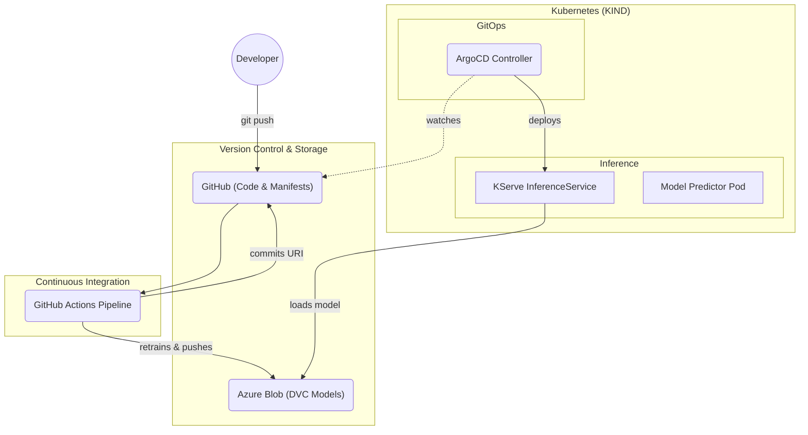

# Realtime MLOps Pipeline: Customer Churn Predictor 

A fully automated, production-grade MLOps demonstration for a customer churn prediction model. This project leverages **Azure Blob Storage** for artifact storage, **DVC** for data and metrics versioning, **GitHub Actions** for CI/CD, **ArgoCD** for GitOps deployments, and **KServe** for serverless ML inference.

---

## 📍 Table of Contents
- [What Does This Model Do?](#-what-does-this-model-do)
- [Architecture At A Glance](#-architecture-at-a-glance)
- [Project Structure](#-project-structure)
- [Security & Secrets Setup](#-security--secrets-setup-kubernetes)
- [Prerequisites](#-prerequisites)
- [MLOps Pipeline Steps](#-mlops-pipeline-steps)
- [Test KServe Inference Live](#-test-kserve-inference-live)
- [ArgoCD Setup](#-argocd-gitops)
- [ChurnShield UI (Frontend)](#-churnshield-ui-frontend)
- [Workflow Trace](#-complete-mlops-workflow-trace)

---

## What Does This Model Do?

**Real-World Example:**

Imagine you run a telecom company with thousands of customers. Some customers are happy and stay for years, while others leave (churn) after a few months. This model predicts which customers are likely to leave.

**Example Customer:**
- **Sarah** is 45 years old
- Been a customer for 24 months
- Pays $79.99/month
- Total spent: $1,920
- Called customer support 3 times this month

**Model Prediction:**
```json
{
  "churn": 1,
  "churn_probability": 0.73
}
```

**Translation:** Sarah has a **73% chance of canceling her subscription**. The model flags her so the business can proactively offer a discount or personalized support before she leaves.

**The model looks at patterns like:**
- High monthly charges → More likely to churn
- More support calls → Customer is frustrated
- Low tenure → Haven't built loyalty yet

---

## 🚀 Architecture At A Glance

1. **Source of Truth (Git):** Code, hyperparameters (`params.yaml`), and GitOps configurations live here.
2. **Data Ledger (DVC):** Tracks massive datasets, binaries, and training metrics (`metrics.json`). Artifacts are pushed to Azure Blob Storage using cryptographic hashes.
3. **Continuous Integration (GitHub Actions):** Automatically runs `dvc repro` on code push, pushes new models to Azure, and updates Kubernetes definitions with the newest model URIs.
4. **Continuous Deployment (ArgoCD):** Watches the Git repository for updated Kubernetes definitions. Triggers KServe to spin up new endpoints with zero downtime.
5. **Secure Inference Engine (KServe):** 
    - **Shell-Wrapped Loader**: Uses a custom initContainer to dynamically pull binaries from Azure while managing Kubernetes Secrets.
    - **Secret-Based Auth**: Securely stores SAS tokens in **Kubernetes Secrets** (`az-secret`).
    - **Custom Domain**: Served on `mlops-demo.labs.csi-infra.com` via Nginx Ingress.

### System Diagram


---

## 📁 Project Structure

```text
churn-model/
├── params.yaml                   # Centralized Hyperparameters & Data Configs
├── generate_data.py              # Generate synthetic churn dataset
├── train.py                      # Train the RandomForest model
├── api.py                        # FastAPI local inference server
├── requirements.txt              # Python dependencies
├── Dockerfile                    # Container image for local FastAPI
├── Dockerfile.kserve             # Custom KServe SKLearn server image
├── dvc.yaml & dvc.lock           # DVC pipeline stages and lockfiles
├── metrics.json                  # Model accuracy and AUC-ROC (Tracked by DVC)
├── .dvc/config                   # DVC remote config (Azure Blob)
├── models/
│   └── churn_model.pkl           # Trained model (uploaded to Azure)
├── k8s/
│   ├── serviceaccount.yaml       # Namespace, Secrets, and ServiceAccount
│   ├── inference.yaml            # KServe InferenceService (Shell-Wrapped)
│   └── inferenceservice-config.yaml # Global KServe networking config (Custom Domain)
├── ui/
│   ├── index.html                # ChurnShield AI — Demo Frontend UI
│   └── server.py                 # Python proxy server (bypasses browser CORS)
├── .github/workflows/
│   └── main.yml                  # GitHub Actions CI/CD pipeline
└── argocd/
    └── application.yaml          # ArgoCD GitOps application
```

---

## 🔐 Security & Secrets Setup (Kubernetes)

This project storing SAS tokens on **Kubernetes Secrets**.

### Create the Azure Secret
Before deploying, create a secret named `az-secret` in the `churn-model` namespace containing your Azure Connection String:

```bash
kubectl create namespace churn-model
kubectl create secret generic az-secret \\
  --from-literal=AZURE_STORAGE_CONNECTION_STRING='your_connection_string_here' \\
  -n churn-model
```

*Note: The KServe pod uses the `sa-az-access` ServiceAccount to grant the model loader access to this secret.*

---

## 🛠 Prerequisites

| Tool | Purpose |
|------|---------|
| Python 3.11+ | Running training and API scripts |
| Docker | Building container images |
| kubectl | Interacting with Kubernetes |
| kind | Running a local Kubernetes cluster |
| Azure CLI (`az`) | Managing Azure Blob Storage |
| Azure Storage Account | `storageaccountmlopspoc` with container `models-container` |
| GitHub Repository | For CI/CD via GitHub Actions |

---

## ⚙️ MLOps Pipeline Steps

### 1. Local Setup & Testing

```bash
# Install dependencies
pip install -r requirements.txt

# Run DVC to generate synthetic datasets and train the model automatically
dvc repro

# Test API locally
python api.py
# Visit http://localhost:8000/docs
```

### 2. 🧪 Local DVC Features & Experiment Tracking

DVC acts as a smart cache and an experiment auditor natively integrated with Git.

#### The Smart Cache
If you run `dvc repro` twice without changing code/parameters, DVC skips computation (`Data and pipelines are up to date`), saving cloud compute costs.

#### The Metrics Diff
Open `params.yaml`, change the `n_estimators`, and run `dvc repro`. Use `dvc metrics diff` to see instantly how your Accuracy and AUC-ROC shifted before committing to Git!
```bash
# Example output:
# Path          Metric    Old      New      Change
# metrics.json  accuracy  0.79155  0.81234  0.02079
# metrics.json  roc_auc   0.84112  0.86543  0.02431
dvc metrics diff
```

#### ⏪ The Time Machine (Rollback Data & Model)
To restore a bad model state locally for debugging, simply checkout the old git commit and pull the old data/model artifacts using DVC:
```bash
# 1. Checkout the previous known good commit
git checkout <old-commit-hash>

# 2. Pull the exact datasets and model binaries for that commit
dvc pull
```

#### 🔄 GitOps Production Rollback
Because ArgoCD manages our cluster based on Git, rolling back production is as simple as reverting the commit that broke it.
```bash
# Revert the bad commit in Git
git revert <bad-commit-hash>
git push origin main

# ArgoCD will automatically detect the reverted state and deploy the old model!
```

### 3. GitHub Actions CI/CD

The pipeline runs automatically on push to `main`. It achieves "Invisible MLOps":
1. Triggers DVC pipeline dynamically reading from Azure Connection Strings
2. Uploads updated DVC storage chunks safely (Hashes logic)
3. Uploads raw .pkl securely directly to the Azure KServe path using Git SHAs
4. Updates `k8s/inference.yaml` storageUri securely via Python `update_yaml.py`
5. Commits `dvc.lock`, `metrics.json` and the YAML updates back automatically.

### 4. Kubernetes with KIND & KServe

```bash
# Create cluster
kind create cluster --name churn-model

# Install KServe
kubectl apply -f https://github.com/kserve/kserve/releases/download/v0.11.0/kserve.yaml

# Install Ingress Nginx (Required for local custom domains)
kubectl apply -f https://raw.githubusercontent.com/kubernetes/ingress-nginx/main/deploy/static/provider/kind/deploy.yaml

# Map the domain (on your host machine)
echo "127.0.0.1 mlops-demo.labs.csi-infra.com" | sudo tee -a /etc/hosts
echo "127.0.0.1 churn-predictor-churn-model.mlops-demo.labs.csi-infra.com" | sudo tee -a /etc/hosts
```

### 5. Deploy the Inference Service

```bash
# Apply namespace, secret, and service account
kubectl apply -f k8s/serviceaccount.yaml

# Deploy the KServe inference service
kubectl apply -f k8s/inference.yaml

# Watch until READY = True
kubectl get inferenceservice churn-predictor -n churn-model -w
```
> **KServe Azure Authentication Note:** KServe downloads the model from Azure Blob using the Kubernetes secret referenced by the ServiceAccount (`sa-az-access` / `az-secret`).

### 6. Test KServe Inference Live

Both methods require the correct **5-feature set**: `age`, `tenure_months`, `monthly_charges`, `total_charges`, `num_support_calls`.

#### Localhost Testing (Port-Forwarding)
```bash
# Terminal 1: Port-forward ingress

nohup kubectl port-forward -n ingress-nginx service/ingress-nginx-controller 10000:80 > /tmp/ingress-forward.log 2>&1 &

# Terminal 2: Prediction via Localhost (using Host header)
# Test prediction (sklearn expects data as an ordered array)
# Order: age, tenure_months, monthly_charges, total_charges, num_support_calls

curl -X POST http://churn-predictor-churn-model.mlops-demo.labs.csi-infra.com:10000/v1/models/churn-predictor:predict \
  -H "Content-Type: application/json" \
  -d '{
    "instances": [
      [45, 24, 79.99, 1920.00, 3]
    ]
  }'

OR 

nohup kubectl port-forward -n churn-model service/churn-predictor-predictor 8000:80 > /tmp/churn-forward.log 2>&1 &

curl -X POST http://localhost:8000/v1/models/churn-predictor:predict \
  -H "Content-Type: application/json" \
  -d '{
    "instances": [
      [45, 24, 79.99, 1920.00, 3]
    ]
  }'
```


### 7. ArgoCD (GitOps)

ArgoCD watches the Git repository for changes to `k8s/inference.yaml` and automatically deploys the latest model to Kubernetes.

```bash
# Install ArgoCD
kubectl create namespace argocd
kubectl apply -n argocd -f https://raw.githubusercontent.com/argoproj/argo-cd/stable/manifests/install.yaml

# Wait for ArgoCD to be ready
kubectl wait --for=condition=ready pod -l app.kubernetes.io/name=argocd-server -n argocd --timeout=120s

# Deploy the ArgoCD application (points to this repo)
kubectl apply -f argocd/application.yaml

# Access ArgoCD UI (visit https://localhost:8080)
kubectl port-forward svc/argocd-server -n argocd 8080:443

# Get the initial admin password
kubectl -n argocd get secret argocd-initial-admin-secret -o jsonpath="{.data.password}" | base64 -d
```

---

## 🖥️ ChurnShield UI (Frontend)

**ChurnShield AI** is a responsive, production-quality demo dashboard that lets you visually test the churn prediction model through a browser. It features animated input sliders, a risk gauge, and AI-generated retention recommendations.

### How it works

Because browsers block cross-origin requests (CORS), the frontend uses a lightweight **Python proxy server** that:
1. Serves the UI at `http://localhost:5000`
2. Forwards `/predict` requests server-side to KServe (bypassing CORS restrictions)

### Launch Steps

**Step 1 — Start the KServe port-forward** (in a background terminal):
```bash
nohup kubectl port-forward -n ingress-nginx service/ingress-nginx-controller 10000:80 > /tmp/ingress-forward.log 2>&1 &
```

**Step 2 — Start the proxy + UI server:**
```bash
cd ui
python3 server.py
```

**Step 3 — Open in browser:**
```
http://localhost:5000
```

### Demo Scenarios

| Customer Type | Age | Tenure | Monthly $ | Total $ | Calls | Expected Result |
|---|---|---|---|---|---|---|
| Happy long-term | 55 | 48 | 35 | 1680 | 0 | 🟢 Low Risk |
| New struggling | 28 | 3 | 120 | 360 | 7 | 🔴 High Risk |
| At-risk mid-tier | 40 | 12 | 90 | 1080 | 4 | ⚠️ Medium Risk |

> **Note:** The UI displays a risk probability percentage derived from the input features as a visual enhancement for demos, since the standard KServe SKLearn server returns binary predictions (0 or 1).

---

## 🔁 Complete MLOps Workflow Trace

- [ ] **Developer** pushes code/parameters to GitHub (main branch)
- [ ] **GitHub Actions Pipeline** triggers:
  - [ ] Recomputes cached Data Logic (DVC)
  - [ ] Retrains model using parameters / metrics (`churn_model.pkl`)
  - [ ] Uploads hashes privately → Azure Blob Storage
  - [ ] Uploads raw `.pkl` securely to Azure via Git SHA path
  - [ ] Updates `k8s/inference.yaml` storageUri via `update_yaml.py`
  - [ ] Commits `metrics.json` and `dvc.lock` back into Git
- [ ] **ArgoCD** detects change in `k8s/inference.yaml`
- [ ] **ArgoCD** syncs state → applies changes to Kubernetes
- [ ] **KServe** securely loads model from Azure using `az-secret`
- [ ] **KServe** serves predictions via Custom Domain on Nginx Ingress

---

## 🛠 Local API Usage (`api.py`)

If you are running the FastAPI server locally (outside of Kubernetes) for rapid development:

```bash
# Start the local server
python api.py

# Send a test prediction
curl -X POST http://localhost:8000/predict \
  -H "Content-Type: application/json" \
  -d '{
    "age": 45,
    "tenure_months": 24,
    "monthly_charges": 79.99,
    "total_charges": 1920.00,
    "num_support_calls": 3
  }'
```

---

## 📊 Key Components Summary

| Component | Role / Purpose |
|-----------|----------------|
| **Azure Blob Storage** | Persistent Model Registry (`storageaccountmlopspoc`) |
| **DVC** | Data & Model versioning/tracking |
| **GitHub Actions** | CI/CD — Automation of training and manifest updates |
| **KServe** | Serverless ML Inference & Auto-scaling |
| **ArgoCD** | GitOps Managed Lifecycle & Drift Detection |
| **Kubernetes Secrets** | Secure Credential Management (`az-secret`) |
| **Ingress Nginx** | Traffic Routing for `mlops-demo` Custom Domain |
| **KIND / Minikube** | Local Kubernetes Infrastructure |
| **ChurnShield UI** | Browser-based Demo Frontend (`ui/index.html` + `ui/server.py`) |

---

## 📝 Notes
- `k8s/inference.yaml` points to the Azure Blob model path (no SAS embedded). Regenerate/update your Azure connection string secret in Kubernetes if credentials change.
- `k8s/serviceaccount.yaml` references the Kubernetes secret (`az-secret`) used by KServe to download from Azure Blob.
- This is a demo project — production setups require monitoring, logging, secret rotation, and security hardening.
