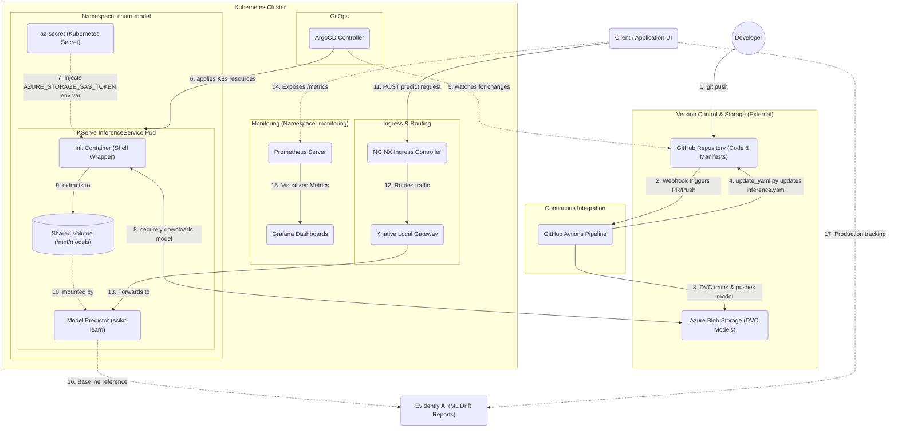

# Realtime MLOps Pipeline Architecture

This document provides a high-level overview of the end-to-end MLOps pipeline for the Churn Prediction model. The pipeline is fully automated and designed around GitOps principles, ensuring secure model delivery, version control, and scalable inference.

## Architecture Diagram

## Component Breakdown & Workflow Steps

The architecture follows four distinct phases: **Development**, **Continuous Integration (CI)**, **GitOps Deployment (CD)**, and **Secure Model Inference**.

### 1. Version Control & Storage
* **GitHub Repository (Git)**: Acts as the absolute single source of truth. Contains the source code, Data Version Control (`DVC`) tracking files, and Kubernetes cluster configurations (`inference.yaml`).
* **Azure Blob Storage**: The remote storage backend configured for DVC. It holds large datasets and the compiled model artifacts (`.pkl` files) which are too large for Git. 

### 2. Continuous Integration (GitHub Actions)
Whenever a developer commits changes to the repository:
* **Step 1 & 2**: A GitHub Actions workflow is triggered.
* **Step 3**: The pipeline uses `dvc pull` and evaluates model metrics in a reproducible environment. If the model is retrained, DVC pushes the updated `.pkl` binary back up to Azure Blob Storage.
* **Step 4**: A python script (`update_yaml.py`) automatically modifies `k8s/inference.yaml` with the latest model build/hash prefix, committing those changes directly back into the main branch. 

### 3. Continuous Deployment (GitOps via ArgoCD)
* **Step 5**: ArgoCD continuously watches the cluster configuration folder in the GitHub repository. 
* **Step 6**: The moment the GitHub Action auto-commits the new model URI in `inference.yaml`, ArgoCD detects the specific difference and syncs (applies) those changes into the Kubernetes cluster.

### 4. Secure KServe Inference
* **Step 7**: ArgoCD creates a new KServe `InferenceService`. Instead of storing insecure credentials plainly in our git repository, a Kubernetes secret (`az-secret`) bounds its data to our Pod.
* **Step 8 & 9**: A custom, shell-wrapped `initContainer` is spun up. At runtime, it securely receives the `AZURE_STORAGE_SAS_TOKEN` extracted from the cluster secret. It securely curls and downloads the model from Azure Blob Storage down into a shared local mount.
* **Step 10**: The **scikit-learn Predictor** container comes online and mounts the populated volume `/mnt/models` to begin serving predictions.

### 5. Client Request & Routing
* **Step 11**: End users or client applications send predictions to the exposed NGINX Ingress controller using the custom domain (`http://churn-predictor-churn-model.mlops-demo.labs.csi-infra.com`).
* **Step 12 & 13**: NGINX safely bridges over internal boundaries by routing traffic to the internal Knative local-gateway, which resolves internal services mapping to deliver your exact HTTP `POST` to the running Model Predictor pod.

### 6. Operations & ML Monitoring
* **Step 14 & 15 (Ops Monitoring)**: The UI effectively serves as a proxy application that exposes inference latencies, requests, and errors via a `/metrics` Prometheus endpoint. A clustered Prometheus configuration scrapes this data continuously to visualize in Grafana.
* **Step 16 & 17 (ML Monitoring)**: Model predictions on real-world simulated client data is tracked seamlessly against the model's fixed baseline (`.csv` reference via DVC), enabling Evidently AI interactive reports that detect data and prediction drift.
