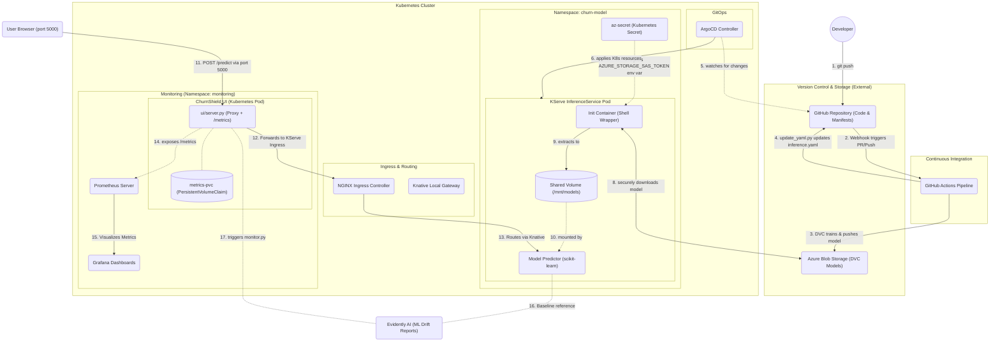

# Realtime MLOps Pipeline Architecture

This document provides a high-level overview of the end-to-end MLOps pipeline for the Churn Prediction model. The pipeline is fully automated and designed around GitOps principles, ensuring secure model delivery, version control, and scalable inference.

## Architecture Diagram

## Component Breakdown & Workflow Steps

The architecture follows four distinct phases: **Development**, **Continuous Integration (CI)**, **GitOps Deployment (CD)**, and **Secure Model Inference**.

### 1. Version Control & Storage
* **GitHub Repository (Git)**: Acts as the absolute single source of truth. Contains the source code, Data Version Control (`DVC`) tracking files, and Kubernetes cluster configurations (`inference.yaml`).
* **Azure Blob Storage**: The remote storage backend configured for DVC. It holds large datasets and the compiled model artifacts (`.pkl` files) which are too large for Git. 

### 2. Continuous Integration (GitHub Actions)
Whenever a developer commits changes to the repository:
* **Step 1 & 2**: A GitHub Actions workflow is triggered.
* **Step 3**: The pipeline uses `dvc pull` and evaluates model metrics in a reproducible environment. If the model is retrained, DVC pushes the updated `.pkl` binary back up to Azure Blob Storage.
* **Step 4**: A python script (`update_yaml.py`) automatically modifies `k8s/inference.yaml` with the latest model build/hash prefix, committing those changes directly back into the main branch. 

### 3. Continuous Deployment (GitOps via ArgoCD)
* **Step 5**: ArgoCD continuously watches the cluster configuration folder in the GitHub repository. 
* **Step 6**: The moment the GitHub Action auto-commits the new model URI in `inference.yaml`, ArgoCD detects the specific difference and syncs (applies) those changes into the Kubernetes cluster.

### 4. Secure KServe Inference
* **Step 7**: ArgoCD creates a new KServe `InferenceService`. Instead of storing insecure credentials plainly in our git repository, a Kubernetes secret (`az-secret`) bounds its data to our Pod.
* **Step 8 & 9**: A custom, shell-wrapped `initContainer` is spun up. At runtime, it securely receives the `AZURE_STORAGE_SAS_TOKEN` extracted from the cluster secret. It securely curls and downloads the model from Azure Blob Storage down into a shared local mount.
* **Step 10**: The **scikit-learn Predictor** container comes online and mounts the populated volume `/mnt/models` to begin serving predictions.

### 5. Client Request & Routing
* **Step 11**: End users or client applications send predictions to the exposed NGINX Ingress controller using the custom domain (`http://churn-predictor-churn-model.mlops-demo.labs.csi-infra.com`).
* **Step 12 & 13**: NGINX safely bridges over internal boundaries by routing traffic to the internal Knative local-gateway, which resolves internal services mapping to deliver your exact HTTP `POST` to the running Model Predictor pod.

### 6. Operations & ML Monitoring
* **Step 14 (Ops Monitoring)**: The UI proxy pod exposes a `/metrics` Prometheus endpoint. A Prometheus server running in the same namespace scrapes this endpoint to visualize prediction counts, latency, and error distributions in Grafana.
* **Step 17 (ML Monitoring)**: The UI exposes a `/run-monitoring` endpoint that triggers `monitoring/monitor.py` inside the container using Evidently AI. It compares the production distribution versus the baseline `data/churn_data.csv` and generates interactive HTML drift reports viewable at `/monitoring`.

### 7. ChurnShield UI (Containerized Frontend)

The ChurnShield UI (`ui/server.py`) is **not run as a local process**. It is fully containerized and deployed as a Kubernetes pod:

* **Docker Image** (`ui/Dockerfile.ui`): Packages the proxy server, the Evidently monitoring scripts, and all required data (including `data/`, `models/`, and `params.yaml`) into a single `python:3.11-slim` image with pinned dependencies (`evidently==0.4.9`, `pandas==2.1.4`, `pydantic==1.10.12`).
* **Kubernetes Deployment** (`k8s/ui.yaml`): Deploys the image as a `Deployment` in the `monitoring` namespace. Resource limits (`1 CPU`, `512Mi`) are defined to keep it stable on a local KIND cluster.
* **Persistent Metrics** (`metrics-pvc`): A `PersistentVolumeClaim` (1Gi, `ReadWriteOnce`) is mounted at `/tmp/prometheus_metrics`. This ensures Prometheus counters survive pod restarts, rollouts, and redeployments — so Grafana data is never lost.
* **Access Pattern**: The pod runs at `ClusterIP` (internal). Access from your laptop browser is done via `kubectl port-forward --address 0.0.0.0 -n monitoring svc/churnshield-ui 5000:5000`, binding it on all interfaces so the custom domain `churnshield.mlops-demo.labs.csi-infra.com:5000` resolves correctly.
